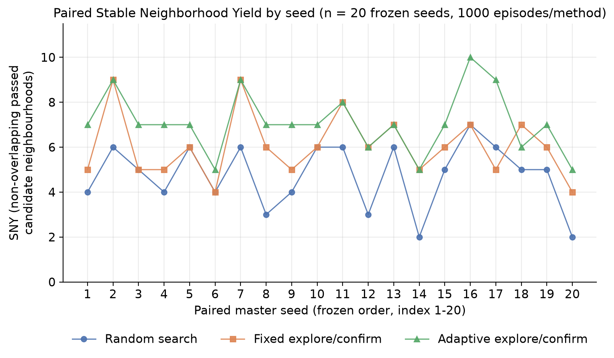
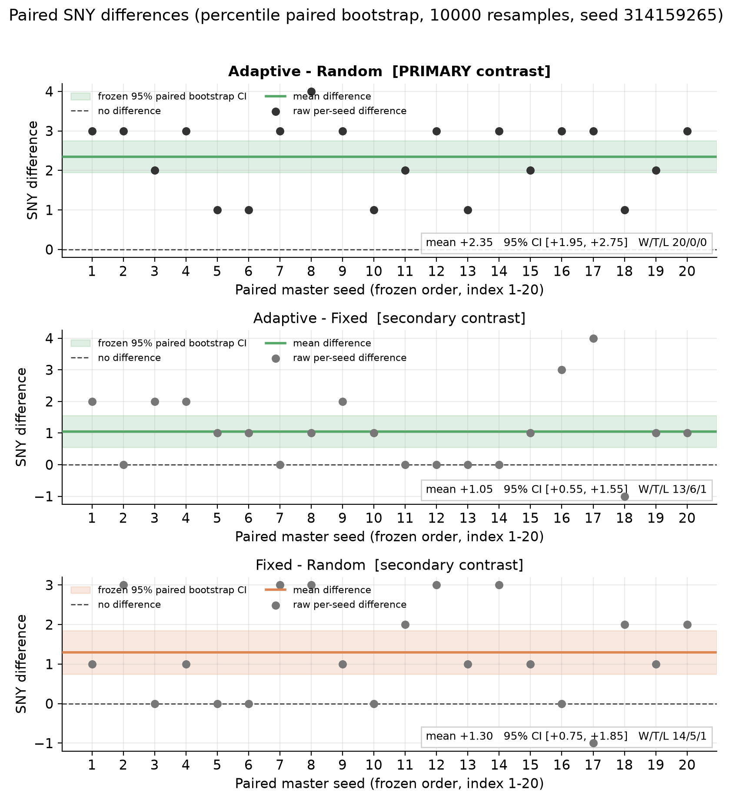
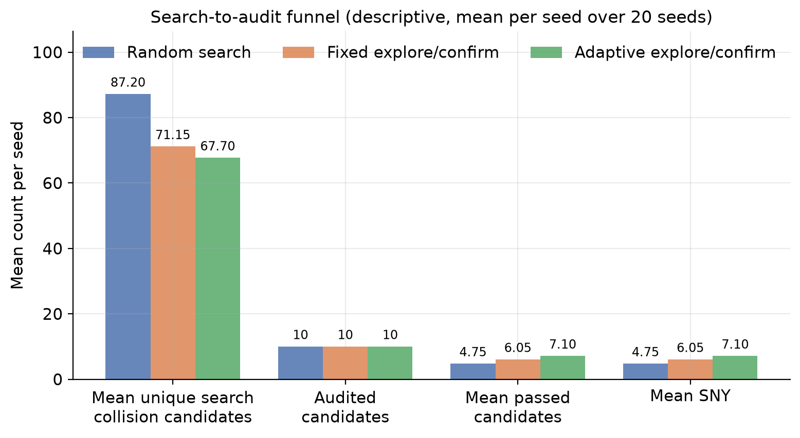

# CornerCaseLab

**Budget-aware scenario testing for autonomous-driving policies.**

Status: **v0.3 formal evaluation completed** — 20 frozen paired seeds × 3 methods ×
1000 episode slots = **60,000 real HighwayEnv episodes**, with 0 simulator errors,
0 interrupted episodes and 0 incomplete Final Audit candidates.

中文文档：[README.zh-CN.md](README.zh-CN.md)

## Overview

Under a **fixed simulation budget**, how should a testing system divide effort between
*exploring* new driving scenarios and *confirming* whether an observed failure survives
small local perturbations?

That trade-off is the subject of this repository. Every method here gets exactly the
same number of simulator episodes per seed, so the comparison is about how the budget is
*allocated*, not how much of it there is. Exploration can only surface candidates;
confirmation consumes budget but can make the nominated candidates more likely to survive
an independent audit. CornerCaseLab implements both sides of that split, an audit that is
independent of the nomination step, and a spatial scoring rule, then measures them under
one frozen protocol.

This is a research project, not a product and not a claim about real-road safety. See
[Limitations](#limitations) and [Interpretation](#interpretation).

## Methods

All three methods receive the identical budget and are paired on the same master seed.

| Method | Search phase | Nomination rule |
|---|---|---|
| **Random Search** | every search episode draws a fresh uniformly sampled scenario | first-seen order (no internal stability estimate) |
| **Fixed Explore/Confirm** | `confirm_repeats = 2` internal confirmations per candidate | rank by internal stability, then first-seen |
| **Adaptive Explore/Confirm** | `pool_fraction = 0.25` → global internal-confirmation cap `floor(0.25 × 700) = 175`, `min_internal_per_candidate = 1`, `max_internal_per_candidate = 5` | rank by internal stability, then first-seen |

Nomination is part of each method: the three methods deliberately operate with different
information sets at the moment they choose which candidates to send to the Final Audit.
The frozen tie-break is
`rank_by_internal_stability_desc_then_first_seen_asc_v1`.

## Experimental protocol

Frozen protocol ID **`cornercaselab_v03_eval_v1`**; scoring protocol **`v03_scoring_v1`**.

| Quantity | Value |
|---|---|
| Frozen paired master seeds | **20** (`policy = boundary`, `purpose = evaluation`) |
| Methods per seed | 3 (paired on the same master seed) |
| Allocated episode slots per method per seed | **1000** |
| Search + internal confirmation pool | **700** |
| Final Audit pool | **300** = 10 candidates × 30 repeats |
| Total episodes | **60,000** |
| Errors / interrupted / incomplete audit candidates | **0 / 0 / 0** |

**Final Audit.** Each of the 10 nominated candidates is re-tested 30 times with fresh
background randomness. Audit launches are charged to the same budget counter as search,
and unused audit allocation is never re-spent elsewhere
(`no_backfill_leave_unused_audit_reservation_unspent_v1`).

**A candidate is *stable*** when it has exactly 30 valid Final Audit observations and the
Wilson two-sided 95% interval (no continuity correction) for its collision proportion has
a **lower bound > 0.5** — equivalently **≥ 21/30** of its audit runs end in an ego
collision. Fewer than 30 valid observations yields `incomplete` with the stability verdict
left null (`stable = null`), never `false`.

Seeds are derived, not chosen: `seed_i = first four bytes, big-endian, of
SHA256("CornerCaseLab-v0.3-formal-{i}")`, `i = 0..19`. The calibration seed `20261003` is
reserved for `purpose = development` runs and is refused for evaluation.

See [`docs/EVALUATION_PROTOCOL_V03.md`](docs/EVALUATION_PROTOCOL_V03.md),
[`docs/SCORING_PROTOCOL_V03.md`](docs/SCORING_PROTOCOL_V03.md) and
[`configs/eval_v03_formal.json`](configs/eval_v03_formal.json).

## Primary metric

**Stable Neighborhood Yield (SNY)** = `nonoverlapping_passed_count`: the **exact
maximum** number of pairwise non-overlapping neighbourhoods among the candidates that
passed the Final Audit. Neighbourhoods are axis-aligned boxes in the frozen six-parameter
perturbation space; overlap is solved exactly (maximum independent set with
lexicographic tie-break), not approximated by a greedy pass.

> **SNY is a proxy.** It is **not** a root-cause count, **not** a real crash probability,
> and **not** a count of true failure regions. A scenario hash identifies parameters, not
> an independent bug or failure cause.

## Formal results

Mean SNY over the 20 paired seeds (full per-seed values in
[`raw_sny_by_seed.csv`](reports/formal_v03/raw_sny_by_seed.csv)):

| Method | n | **Mean SNY** | Median | SD (ddof 1) | IQR |
|---|---|---|---|---|---|
| Random Search | 20 | **4.75** | 5.00 | 1.446 | 2.00 |
| Fixed Explore/Confirm | 20 | **6.05** | 6.00 | 1.432 | 2.00 |
| Adaptive Explore/Confirm | 20 | **7.10** | 7.00 | 1.373 | 0.50 |

Frozen paired contrasts — percentile **paired** bootstrap, **10,000** resamples,
analysis seed **314159265**, 95% CI:

| Role | Contrast | Mean difference | 95% CI |
|---|---|---|---|
| **primary** | Adaptive − Random | **+2.35** | **[1.95, 2.75]** |
| secondary | Adaptive − Fixed | **+1.05** | **[0.55, 1.55]** |
| secondary | Fixed − Random | **+1.30** | **[0.75, 1.85]** |

The primary success criterion is **effect size together with its uncertainty**; each
interval lies entirely above zero on the frozen SNY scale. **No p-value is reported and
none is used as a criterion** — the frozen analysis plan does not define one. Full
numbers: [`table_primary_results.csv`](reports/formal_v03/table_primary_results.csv),
[`table_paired_contrasts.csv`](reports/formal_v03/table_paired_contrasts.csv).

## Figures



*Paired SNY for all 20 frozen seeds — the same seed appears in all three series, so
per-seed relative ordering is directly visible; no smoothing and no hidden seeds.*



*Raw per-seed paired differences with the mean, the frozen 95% paired-bootstrap CI and a
zero reference line; the primary contrast is marked.*



*Descriptive funnel per method: mean unique search collision candidates → 10 audited
candidates → mean passed candidates → mean SNY. This is a descriptive device, not a new
hypothesis test.*

Three further figures (SNY distribution, budget allocation, audit pass proportion) are in
[`reports/formal_v03/`](reports/formal_v03).

## Interpretation

**Confirmatory** (frozen, pre-registered): the SNY analysis, the three paired contrasts
and their bootstrap intervals reported above.

**Descriptive** (same frozen data, no inference):

| Quantity | Random | Fixed | Adaptive |
|---|---|---|---|
| Mean unique search collision candidates / seed | **87.20** | **71.15** | **67.70** |
| Final Audit pass proportion | **95/200 = 47.5%** | **121/200 = 60.5%** | **142/200 = 71.0%** |
| Mean internal-confirmation episodes / seed | 0.00 | 142.15 | **175.00** |
| Seeds that reached the 175 cap | — | 0/20 | **20/20** |

Random search surfaced **more** search collision candidates on average, yet a **smaller**
fraction of its nominated candidates passed the independent Final Audit. Fixed and
Adaptive spent part of the search pool on internal confirmation instead of fresh
exploration, and surfaced fewer distinct candidates. Under the frozen protocol, Adaptive
achieved the highest SNY.

**Exploratory (not pre-registered).** These results are **consistent with a
breadth-versus-stability trade-off**: spending part of the budget on internal confirmation
may raise nomination quality at the cost of exploration breadth. This is a hypothesis, not
an established mechanism. Method identity bundles the nomination rule, the budget split and
the information set, so the design cannot attribute the effect to confirmation alone, and
no ablation was run. Within each method the per-seed correlation between candidate count
and SNY is weak and negative (Adaptive −0.06, Random −0.09, Fixed −0.21; descriptive only,
n = 20, no test).

One further descriptive fact: in this formal run `passed_candidate_count == SNY` for
**all 60** seed–method combinations. That is, **at the frozen neighbourhood scale, no
overlap among passed candidates was observed that spatial deduplication had to remove.**
It is *not* evidence that those candidates have distinct root causes.

The full narrative, with explicit CONFIRMATORY / DESCRIPTIVE / EXPLORATORY labels and a
list of unsupported claims, is in
[`RESULTS_INTERPRETATION.md`](reports/formal_v03/RESULTS_INTERPRETATION.md).

## Reproducibility

Public release provenance: [`docs/PUBLIC_RELEASE.md`](docs/PUBLIC_RELEASE.md). This
public repository is a sanitized v0.3.0 release snapshot; the complete original research
and development Git history is retained in a private research archive and is not
published here.

What is version-controlled here: the frozen config, both protocol documents, the
simulator/scoring/analysis implementation, the test suite, and the **derived** results
(figures, tables, raw per-seed SNY, descriptive JSON) plus the data freeze.

What is intentionally **not** in the repository: the raw formal run itself
(`runs/v03_formal_eval_…`, 218 MB of ledgers, checkpoints and per-candidate records). It is
ignored by Git by design, so a fresh clone can read every published number but cannot
re-score the raw episodes without re-running them.

* **Data freeze** — [`FORMAL_DATA_FREEZE.json`](reports/formal_v03/FORMAL_DATA_FREEZE.json)
  and [`formal_data_file_sha256.csv`](reports/formal_v03/formal_data_file_sha256.csv) record
  SHA256 for **all 415** files of the formal run, the key manifests, the frozen config, the
  analysis output, the seed order and the provenance of each batch.
* **Offline re-derivation** — `scripts/render_formal_results_v03.py` re-reads the saved
  results, recomputes every confirmatory number with **two independent implementations**
  (the frozen analysis code and a standalone bootstrap), and **exits non-zero without
  writing anything** if any number disagrees. It launches zero simulator episodes.
  It requires the raw run directory to be present.
* **Provenance** — seeds 1–5 were produced under commit `c7b2d01`, seeds 6–20 under
  `f580d02`, and the reported analysis under `25c86cd`. The three commits differ **only**
  in `scripts/run_v03_formal.py` (orchestration); the protocol, simulator, scoring and
  analysis implementations are unchanged across them.

```powershell
# environment + full test suite (272 tests)
py -3.13 -m venv .venv
.\.venv\Scripts\python.exe -m pip install -e ".[sim]"
.\.venv\Scripts\python.exe -m unittest discover -s tests -v
.\.venv\Scripts\python.exe -m cornercaselab doctor --smoke

# formal evaluation driver (20 paired seeds, 60,000 episodes; refuses to touch the
# frozen protocol and stops on any integrity failure)
.\.venv\Scripts\python.exe scripts\run_v03_formal.py

# offline scoring of a saved run
.\.venv\Scripts\python.exe scripts\score_v03.py --input runs\<run-dir> --out runs\<new-dir>

# re-derive and verify the frozen confirmatory numbers + regenerate figures/tables
.\.venv\Scripts\python.exe scripts\render_formal_results_v03.py
.\.venv\Scripts\python.exe scripts\render_formal_results_v03.py --check-only
```

Note on restricted environments: eight of the 272 tests use Python's `tempfile`, which a
restricted-write sandbox blocks; they pass in a normal environment. The whole suite passed
in full before the formal results were frozen.

## Quick start

Use an isolated Python 3.11–3.13 environment. On Windows, `start.ps1` picks a supported
interpreter, creates `.venv`, installs dependencies, runs the tests, does a smoke check and
then runs a 100-episode pilot:

```powershell
.\start.ps1
```

Manual, from the repository root:

```powershell
py -3.13 -m venv .venv
.\.venv\Scripts\python.exe -m pip install -e ".[sim]"
.\.venv\Scripts\python.exe -m unittest discover -s tests -v
.\.venv\Scripts\python.exe -m cornercaselab doctor --smoke
.\.venv\Scripts\python.exe -m cornercaselab run --episodes 100 --seed 20261003 --out runs/pilot01
```

Linux uses the same commands with `.venv/bin/python`. Direct simulator dependencies are
pinned to HighwayEnv 1.10.2 and Gymnasium 1.2.2 as a fixed interface target, not as a claim
that they are the newest releases.

Replay and local confirmation remain available (they are the v0.1-era building blocks, not
the formal comparison):

```powershell
.\.venv\Scripts\python.exe -m cornercaselab replay runs/pilot01/cases/000000.json --gif runs/case0.gif
.\.venv\Scripts\python.exe -m cornercaselab confirm runs/pilot01/cases/000000.json --repeats 20 --out runs/confirm01
```

`000000.json` is simply the first executed case and is **not** promised to be a failure.
Strict replay checks reproducibility; it is not evidence about accident probability.
Confirmation adds new simulations that are **not** free.

## Repository layout

```text
cornercaselab/          core engine: budget accounting, candidates, experiments,
                        checkpointing, scoring, analysis, frozen-protocol validation
configs/                frozen config: eval_v03_formal.json
scripts/                run_v03_formal.py, score_v03.py, render_formal_results_v03.py,
                        v0.3 development drivers, smoke driver
docs/                   evaluation + scoring protocols, research plan, validation,
                        attribution, related work
reports/formal_v03/     published results: figures (PNG+PDF), tables (CSV),
                        raw_sny_by_seed.csv, data freeze, results narrative
tests/                  272 unit/integration tests, including protocol and scoring tests
runs/                   run outputs (gitignored — raw formal data is not distributed)
```

## Limitations

1. **SNY is a proxy, not ground truth** — not root causes, not crash probability, not true
   failure regions.
2. **20 paired seeds is the frozen protocol size**, not a power calculation; the intervals
   describe uncertainty across these 20 runs, not across all possible seeds.
3. **Nomination is part of the method**, so the three methods used different information
   sets; the comparison is between end-to-end methods, not between nomination rules alone.
4. **Confounded design** — method identity bundles the nomination rule, the budget split
   and the information set. No ablation isolating confirmation was run.
5. **Simulation only.** Results come from the simplified simulator and controller in this
   repository and say nothing about real vehicles or real traffic.
6. **Adaptive was cap-limited.** Adaptive reached the frozen 175-episode internal
   confirmation cap in all 20 seeds, so its behaviour was partly determined by the frozen
   parameterisation rather than by its own stopping logic.
7. **Spatial deduplication was inert** in this dataset (`passed == SNY` everywhere), so SNY
   and passed-candidate count are numerically interchangeable here.
8. Frozen bounds, perturbation scale, controller and audit design; 32-bit derived seeds;
   one audit sample per candidate with no backfill.

## Development history

Earlier milestones are superseded by the v0.3 results above and are kept only for context:

* **v0.1** — the initial measurement infrastructure: a six-parameter highway/ramp-merge
  scenario adapter, two fixed observation-only pilot controllers, separate search and
  simulation seeds, per-case JSON plus an append-only ledger, strict replay against
  environment/source fingerprints, and fixed-n fresh-perturbation confirmation. At that
  point no original-method comparison existed, and real HighwayEnv execution was not yet
  verified in the preparation environment.
* **v0.2** — shared budget accounting, checkpoint/resume with sealed interrupted
  episodes, reproducibility metadata, and seed-stream collision guards.
* **v0.3** — stability criterion, spatial SNY scoring, the frozen formal protocol and the
  completed formal evaluation reported here.

## Attribution and related work

HighwayEnv supplies the road geometry, vehicle dynamics, background IDM behaviour, action
implementation and renderer; Gymnasium supplies the environment interface; NumPy supplies
numerics; Pillow supplies optional GIF output; matplotlib is used by the tracked figure
renderer. These are installed as dependencies, not bundled, and they keep their own
licenses. See [`docs/ATTRIBUTION.md`](docs/ATTRIBUTION.md) and
[`docs/RELATED_WORK.md`](docs/RELATED_WORK.md). This repository was prepared with AI
assistance used as a tool; see [`docs/PROVENANCE.md`](docs/PROVENANCE.md) for the
provenance and copyright record and the attribution notice for the disclosure statement.

## License

CornerCaseLab's own code and documentation are licensed under the **Apache License,
Version 2.0** — see [`LICENSE`](LICENSE). Third-party dependencies remain under their own
licenses and are not relicensed by this project. Dependency attribution is in
[`docs/ATTRIBUTION.md`](docs/ATTRIBUTION.md); the provenance and copyright record is in
[`docs/PROVENANCE.md`](docs/PROVENANCE.md).
